# Design Document

## Overview

基于 Oops Framework 和 Cocos Creator 3.8.6 开发的"Dog Crash"崩盘游戏。游戏采用"Hold to Fly"机制，玩家控制小狗乘坐火箭飞行，通过按住HOLD按钮控制飞行，松开按钮进行提现。游戏采用简洁的界面设计，包含核心的游戏功能、历史记录、排行榜等。使用ECS架构模式，将游戏逻辑分离为实体、组件和系统，确保代码的可维护性和扩展性。

## Architecture

### 技术架构
- **游戏引擎**: Cocos Creator 3.8.6
- **框架**: Oops Framework 2.0 (版本: 2.0.0.20250514)
- **架构模式**: ECS (Entity-Component-System)
- **核心模块访问**: 通过 `oops` 全局对象统一访问
- **UI管理**: `oops.gui` - LayerManager 多层级界面管理
- **资源管理**: `oops.res` - ResLoader 统一资源加载
- **音频管理**: `oops.audio` - AudioManager (音乐+音效分离管理)
- **本地存储**: `oops.storage` - StorageManager (支持加密)
- **多语言**: `oops.language` - LanguageManager
- **特效管理**: `oops.pool` - EffectSingleCase 对象池
- **时间管理**: `oops.timer` - TimerManager
- **消息系统**: `oops.message` - MessageManager
- **ECS系统**: `oops.ecs` - ECSRootSystem
- **网络通信**: `oops.http` (HTTP) + `oops.tcp` (WebSocket) - MVP版本暂不实现
- **服务器端**: Node.js + Express + MongoDB - 设计保留，后期实现
- **数据同步**: RESTful API + 实时WebSocket - MVP版本使用本地存储

### 项目目录结构
```
dog-crash-game/
├── assets/                    # 客户端资源和代码
│   ├── script/
│   │   └── game/             # 游戏逻辑代码
│   │       ├── comp/         # ECS组件
│   │       │   ├── GameStateComp.ts     # 游戏状态组件
│   │       │   ├── BettingComp.ts       # 下注组件
│   │       │   ├── MultiplierComp.ts    # 倍数组件
│   │       │   ├── UserDataComp.ts      # 用户数据组件
│   │       │   ├── LocalDataComp.ts     # 本地数据组件
│   │       │   └── GameHistoryComp.ts   # 游戏历史组件
│   │       ├── system/       # ECS系统
│   │       │   ├── CrashGameSystem.ts   # 主游戏系统
│   │       │   ├── MultiplierSystem.ts  # 倍数计算系统
│   │       │   └── UserDataSystem.ts    # 用户数据系统
│   │       ├── entity/       # ECS实体
│   │       │   └── CrashGame.ts         # 主游戏实体
│   │       ├── ui/           # UI界面组件
│   │       │   └── MainGameUI.ts        # 主游戏界面
│   │       ├── config/       # 游戏配置
│   │       │   ├── CrashGameConfig.ts   # 游戏配置
│   │       │   ├── CrashGameAudio.ts    # 音频管理
│   │       │   └── CrashGameLanguage.ts # 多语言管理
│   │       ├── common/       # 通用模块（现有）
│   │       │   ├── config/
│   │       │   │   ├── GameUIConfig.ts  # UI配置（统一使用）
│   │       │   │   ├── GameEvent.ts     # 游戏事件配置
│   │       │   │   └── GameStorageConfig.ts # 存储配置
│   │       │   ├── table/    # 数据表
│   │       │   └── tips/     # 提示管理
│   │       ├── account/      # 账户模块（现有）
│   │       ├── initialize/   # 初始化模块（现有）
│   │       ├── data/         # 数据模型
│   ├── resources/            # 基础资源（警告框、loading等）
│   │   └── config/
│   │       └── game_config.json
│   ├── bundle/               # 远程资源包
│   │   ├── common/           # 通用资源包
│   │   ├── config/           # 配置资源包
│   │   ├── game/             # 游戏资源包
│   │   │   ├── audio/        # 音频文件
│   │   │   ├── textures/     # 纹理资源
│   │   │   ├── prefabs/      # 游戏预制体
│   │   │   │   ├── ui/       # UI预制体
│   │   │   │   └── effects/  # 特效预制体
│   │   │   └── effects/      # 特效资源
│   │   ├── gui/              # GUI资源包
│   │   ├── language/         # 多语言资源包
│   │   └── libs/             # 库资源包
│   └── scenes/               # 场景文件
│       └── Main.scene
├── extensions/               # Oops Framework插件
│   ├── oops-plugin-framework/
│   ├── oops-plugin-excel-to-json/
│   └── oops-plugin-hot-update/
└── server/                   # 服务器端代码（设计保留，后期实现）
    ├── package.json
    ├── app.js               # Express应用入口
    ├── config/
    │   ├── database.js      # 数据库配置
    │   └── server.js        # 服务器配置
    ├── models/              # 数据库模型
    │   ├── User.js
    │   ├── MultiplierTable.js
    │   ├── GameSession.js
    │   └── GameConfig.js
    ├── routes/              # API路由
    │   ├── user.js
    │   └── game.js
    ├── controllers/         # 控制器
    │   ├── userController.js
    │   └── gameController.js
    ├── services/            # 业务逻辑服务
    │   └── gameLogic.js
    ├── middleware/          # 中间件
    │   ├── auth.js
    │   └── validation.js
    └── utils/               # 工具函数
        └── helpers.js
```

### 系统架构图

```mermaid
graph TB
    subgraph "Oops Framework Core"
        OOPS[oops 全局对象] --> AUDIO[oops.audio - AudioManager]
        OOPS --> GUI[oops.gui - LayerManager]
        OOPS --> RES[oops.res - ResLoader]
        OOPS --> STORAGE[oops.storage - StorageManager]
        OOPS --> ECS[oops.ecs - ECSRootSystem]
        OOPS --> TIMER[oops.timer - TimerManager]
        OOPS --> MSG[oops.message - MessageManager]
        OOPS --> POOL[oops.pool - EffectSingleCase]
        OOPS --> HTTP[oops.http - HttpRequest]
        OOPS --> LANG[oops.language - LanguageManager]
    end
    
    subgraph "客户端 (Client)"
        subgraph "ECS Systems"
            ECS --> CS[CrashGameSystem]
            CS --> GS[GameStateSystem]
            CS --> RS[RocketSystem]
            CS --> MS[MultiplierSystem]
            CS --> BS[BettingSystem]
            CS --> US[UserSyncSystem]
            CS --> AS[AudioSystem]
            CS --> GSS[GameSessionSystem]
        end
        
        subgraph "UI Layers (oops.gui)"
            GUI --> LOADING[Loading Layer]
            GUI --> GAME[Game Layer]
            GUI --> POPUP[PopUp Layer]
            GUI --> DIALOG[Dialog Layer]
            GUI --> NOTIFY[Notify Layer]
            
            GAME --> MAIN[MainGameUI]
            POPUP --> HISTORY[HistoryUI]
            POPUP --> LEADERBOARD[LeaderboardUI]
            DIALOG --> SETTINGS[SettingsUI]
        end
        
        subgraph "Game Entities"
            CRASHGAME[CrashGame Entity]
            DOGROCKET[DogRocket Entity]
            CRASHGAME --> GAMESTATE[GameStateComp]
            CRASHGAME --> BETTING[BettingComp]
            CRASHGAME --> MULTIPLIER[MultiplierComp]
            CRASHGAME --> USERDATA[UserDataComp]
            CRASHGAME --> NETWORK[NetworkSyncComp]
            DOGROCKET --> ROCKETVIEW[RocketViewComp]
        end
        
        subgraph "Audio & Effects"
            AUDIO --> MUSIC[Background Music]
            AUDIO --> EFFECTS[Sound Effects]
            POOL --> PARTICLES[Particle Effects]
            POOL --> ANIMATIONS[Spine/Animation]
        end
        
        subgraph "Data & Storage"
            STORAGE --> USERPREFS[User Preferences]
            STORAGE --> GAMEHISTORY[Game History]
            STORAGE --> USERID[User ID]
        end
    end
    
    subgraph "服务器端 (Server)"
        EXPRESS[Express Server] --> USERAPI[User API]
        EXPRESS --> GAMEAPI[Game API]
        EXPRESS --> MULTAPI[Multiplier API]
        EXPRESS --> WSSERVER[WebSocket Server]
        
        MONGODB[MongoDB] --> USERS[Users Collection]
        MONGODB --> GAMECONFIG[Game Config Collection]
        MONGODB --> MULTTABLE[Multiplier Table Collection]
        MONGODB --> SESSIONS[Game Sessions Collection]
        
        USERAPI --> USERS
        GAMEAPI --> GAMECONFIG
        GAMEAPI --> SESSIONS
        MULTAPI --> MULTTABLE
    end
    
    HTTP -.->|REST API| EXPRESS
    NETWORK -.->|Data Sync| EXPRESS
```


## Scene System Design

### 分层场景架构
游戏采用分层场景系统，支持背景层和前景层的视差滚动效果，场景切换完全由倍率表格中的Rocket状态驱动。

#### 场景资源结构
```
assets/bundle/game/scenes/
├── ground/
│   ├── ground_back.prefab    # 地面背景层（天空、远山等）
│   └── ground_front.prefab   # 地面前景层（建筑、树木等）
├── sky/
│   ├── sky_back.prefab       # 天空背景层（蓝天、云层等）
│   └── sky_front.prefab      # 天空前景层（热气球、飞鸟等）
├── atmosphere/
│   ├── atmosphere_back.prefab # 大气层背景层（高空云层等）
│   └── atmosphere_front.prefab # 大气层前景层（卫星等）
└── space/
    ├── space_back.prefab     # 太空背景层（星空、星云等）
    └── space_front.prefab    # 太空前景层（太空碎片等）
```

#### 场景切换逻辑
1. **数据驱动**: 倍率表格包含时间、倍率、Rocket状态三个字段
2. **状态映射**: Rocket状态直接对应场景名称（ground/sky/atmosphere/space）
3. **切换类型**:
   - **场景间切换**: 不同Rocket状态间的切换（如ground→sky）
   - **场景内循环**: 相同Rocket状态的无缝循环效果
4. **视差效果**: 背景层滚动较慢，前景层滚动较快，营造深度感

#### 可扩展性设计
- **配置化**: 通过SceneData配置数组轻松添加新场景
- **预制体化**: 每个场景的背景层和前景层独立为预制体
- **组件化**: SceneScriptComp挂载在预制体上处理场景特定逻辑

## Components and Interfaces

### 核心实体 (Entities)

#### 1. CrashGame Entity
游戏主实体，管理整个游戏流程
```typescript
@ecs.register('CrashGame')
export class CrashGame extends ecs.Entity {
    init() {
        this.add(GameStateComp);
        this.add(BettingComp);
        this.add(MultiplierComp);
        this.add(UserDataComp);
        this.add(LocalDataComp);
        this.add(GameHistoryComp);
    }
}
```

#### 2. DogRocket Entity
小狗火箭实体，负责小狗火箭的视觉表现和物理行为
```typescript
@ecs.register('DogRocket')
export class DogRocket extends ecs.Entity {
    init() {
        this.add(RocketViewComp);
        this.add(RocketStateComp);
    }
}
```

### 核心组件 (Components)

#### 1. GameStateComp - 游戏状态组件
```typescript
@ecs.register('GameState')
export class GameStateComp extends ecs.Comp {
    state: GameState = GameState.WAITING;
    startTime: number = 0;
    crashPoint: number = 0;  // 服务器为本局游戏预设的爆率（崩盘倍数）
    
    reset() {
        this.state = GameState.WAITING;
        this.startTime = 0;
        this.crashPoint = 0;
    }
}

enum GameState {
    WAITING,    // 等待下注
    FLYING,     // 火箭飞行中
    CRASHED,    // 火箭崩盘
    CASHED_OUT  // 成功提现
}
```

#### 2. BettingComp - 下注组件
```typescript
@ecs.register('Betting')
export class BettingComp extends ecs.Comp {
    betAmount: number = 0;
    balance: number = 1000;
    isHolding: boolean = false;
    
    reset() {
        this.betAmount = 0;
        this.isHolding = false;
    }
}
```

#### 3. MultiplierComp - 倍数组件
```typescript
@ecs.register('Multiplier')
export class MultiplierComp extends ecs.Comp {
    currentMultiplier: number = 1.0;
    cashOutMultiplier: number = 0;
    multiplierTable: MultiplierTableEntry[] = [];
    startTime: number = 0;
    
    reset() {
        this.currentMultiplier = 1.0;
        this.cashOutMultiplier = 0;
        this.startTime = 0;
    }
}

interface MultiplierTableEntry {
    time: number;        // 时间点（秒）
    multiplier: number;  // 对应的倍数
}
```

#### 4. RocketViewComp - 小狗火箭视图组件
```typescript
import { CCComp } from "db://oops-plugin-framework/module/common/CCComp";

@ccclass('RocketViewComp')
@ecs.register('RocketView', false)
export class RocketViewComp extends CCComp {
    @property(Node)
    rocketNode: Node = null!;
    
    @property(Node)
    dogNode: Node = null!;
    
    @property(ParticleSystem)
    thrustParticle: ParticleSystem = null!;
    
    @property(ParticleSystem)
    explosionParticle: ParticleSystem = null!;
    
    @property(Animation)
    dogAnimation: Animation = null!;
    
    /** 火箭状态 */
    rocketState: RocketState = RocketState.IDLE;
    
    /** 当前高度 */
    currentHeight: number = 0;
    
    /** 起飞动画播放 */
    playTakeoff(): void {
        this.rocketState = RocketState.FLYING;
        this.thrustParticle?.play();
        // 使用oops.pool管理特效
        oops.pool.show("effects/rocket_takeoff", this.node);
    }
    
    /** 崩盘动画播放 */
    playCrash(): void {
        this.rocketState = RocketState.CRASHED;
        this.thrustParticle?.stop();
        this.explosionParticle?.play();
        // 使用oops.pool管理爆炸特效
        oops.pool.show("effects/explosion", this.node);
    }
    
    /** 重置状态 */
    reset(): void {
        this.rocketState = RocketState.IDLE;
        this.currentHeight = 0;
        this.thrustParticle?.stop();
        this.explosionParticle?.stop();
    }
}

enum RocketState {
    IDLE,       // 待机
    FLYING,     // 飞行中
    CRASHED,    // 崩盘
    LANDED      // 成功着陆
}
```

#### 5. UserDataComp - 用户数据组件
```typescript
@ecs.register('UserData')
export class UserDataComp extends ecs.Comp {
    userId: string = "";
    username: string = "";
    joinDate: Date = new Date();
    balance: number = 1000;
    totalFlights: number = 0;
    flightsWon: number = 0;
    highestMultiplier: number = 1.0;
    highestBetAmount: number = 0;
    highestWinAmount: number = 0;
    lastSyncTime: Date = new Date();
    
    reset() {
        this.userId = "";
        this.username = "";
        this.balance = 1000;
        this.totalFlights = 0;
        this.flightsWon = 0;
        this.highestMultiplier = 1.0;
        this.highestBetAmount = 0;
        this.highestWinAmount = 0;
        this.lastSyncTime = new Date();
    }
}

// 用户ID管理器 - 基于Oops Framework的StorageManager
export class UserIdManager {
    private static readonly USER_ID_KEY = "dog_crash_user_id";
    
    // 获取或生成用户ID
    static getUserId(): string {
        let userId = oops.storage.get(this.USER_ID_KEY);
        if (!userId) {
            userId = this.generateUserId();
            oops.storage.set(this.USER_ID_KEY, userId);
        }
        return userId;
    }
    
    // 生成唯一用户ID
    private static generateUserId(): string {
        const timestamp = Date.now().toString(36);
        const randomStr = oops.random.getRandomString(10); // 使用oops.random
        return `${timestamp}_${randomStr}`;
    }
    
    // 清除用户ID（用于测试或重置）
    static clearUserId(): void {
        oops.storage.remove(this.USER_ID_KEY);
    }
    
    // 保存用户数据到本地存储
    static saveUserData(userData: any): void {
        oops.storage.set("user_data", userData);
    }
    
    // 从本地存储加载用户数据
    static loadUserData(): any {
        return oops.storage.getJson("user_data", {});
    }
}
```

#### 6. LocalDataComp - 本地数据组件（MVP版本）
```typescript
@ecs.register('LocalData')
export class LocalDataComp extends ecs.Comp {
    /** 当前游戏会话的崩盘倍数（本地随机生成） */
    currentCrashMultiplier: number = 0;
    
    reset() {
        this.currentCrashMultiplier = 0;
    }
    
    /** 生成本局游戏的崩盘倍数 */
    generateCrashMultiplier(): number {
        // 简单的随机算法，后期可替换为服务器端算法
        const random = Math.random();
        if (random < 0.5) return 1.0 + Math.random() * 2.0; // 1.0 - 3.0
        if (random < 0.8) return 3.0 + Math.random() * 2.0; // 3.0 - 5.0
        if (random < 0.95) return 5.0 + Math.random() * 5.0; // 5.0 - 10.0
        return 10.0 + Math.random() * 10.0; // 10.0 - 20.0
    }
}
```

#### 6. LeaderboardComp - 排行榜组件
```typescript
@ecs.register('Leaderboard')
export class LeaderboardComp extends ecs.Comp {
    leaderboardData: LeaderboardEntry[] = [];
    playerRank: number = 0;
    playerScore: number = 0;
    
    reset() {
        this.leaderboardData = [];
        this.playerRank = 0;
        this.playerScore = 0;
    }
}

interface LeaderboardEntry {
    rank: number;
    username: string;
    avatar: string;
    highestMultiplier: number;
    totalWins: number;
}
```

#### 7. GameHistoryComp - 游戏历史组件
```typescript
@ecs.register('GameHistory')
export class GameHistoryComp extends ecs.Comp {
    gameHistory: GameRecord[] = [];
    maxHistoryCount: number = 50;
    
    addRecord(record: GameRecord): void {
        this.gameHistory.unshift(record);
        if (this.gameHistory.length > this.maxHistoryCount) {
            this.gameHistory.pop();
        }
    }
    
    reset() {
        this.gameHistory = [];
    }
}

interface GameRecord {
    id: number;
    timestamp: number;
    betAmount: number;
    crashMultiplier: number;
    cashOutMultiplier: number;
    profit: number;
    isWin: boolean;
}
```

#### 8. GameResultUI - 游戏结果弹窗组件
```typescript
@ccclass('GameResultUI')
@ecs.register('GameResultUI', false)
export class GameResultUI extends CCComp {
    @property(UIOpacity) bg_opacity: UIOpacity = null!;
    @property(Node) content_node: Node = null!;
    @property(Label) result_title_label: Label = null!;
    @property(Label) coin_amount_label: Label = null!;
    @property(Label) dollar_amount_label: Label = null!;
    @property(Button) close_button: Button = null!;
    @property(Sprite) win_icon: Sprite = null!;
    @property(Sprite) lose_icon: Sprite = null!;
    @property(Label) countdown_label: Label = null!;

    private _close_callback: Function | null = null;
    private _can_close: boolean = false;
    private _countdown_timer: number = 3; // 3秒倒计时

    /**
     * 打开游戏结果弹窗
     * @param params 游戏结果参数 {isWin: boolean, profit: number}
     * @param callback 关闭回调函数
     */
    onOpen(params: GameResultParams, callback: Function): void;
    
    /**
     * 更新结果显示 - 根据胜负状态显示不同的图标、文本和奖励
     */
    private updateResultDisplay(params: GameResultParams): void;
    
    /**
     * 开始3秒倒计时，倒计时结束后自动关闭弹窗
     */
    private startCountdown(): void;
    
    /**
     * 关闭游戏结果弹窗
     */
    closeResult(): void;
}

interface GameResultParams {
    isWin: boolean;    // 是否获胜
    profit: number;    // 收益（正数为盈利，负数为亏损）
}
```

### 核心系统 (Systems)

#### 1. CrashGameSystem - 游戏主控制系统
```typescript
@ecs.register('CrashGameSystem')
export class CrashGameSystem extends ecs.ComblockSystem implements ecs.ISystemUpdate {
    filter(): ecs.IMatcher {
        return ecs.allOf(GameStateComp, BettingComp, MultiplierComp);
    }
    
    update(entity: CrashGame): void {
        const gameState = entity.get(GameStateComp);
        const betting = entity.get(BettingComp);
        const multiplier = entity.get(MultiplierComp);
        
        switch (gameState.state) {
            case GameState.WAITING:
                this.handleWaitingState(entity);
                break;
            case GameState.FLYING:
                this.handleFlyingState(entity);
                break;
            case GameState.CRASHED:
                this.handleCrashedState(entity);
                break;
            case GameState.CASHED_OUT:
                this.handleCashedOutState(entity);
                break;
        }
    }
    
    private handleWaitingState(entity: CrashGame): void {
        // 等待玩家下注和按住HOLD按钮
    }
    
    private handleFlyingState(entity: CrashGame): void {
        // 更新倍数，检查崩盘条件，处理提现
    }
    
    private handleCrashedState(entity: CrashGame): void {
        // 播放崩盘动画，结算游戏
        oops.audio.playEffect("audio/crash_explosion");
    }
    
    private handleCashedOutState(entity: CrashGame): void {
        // 播放成功提现动画，结算收益
        oops.audio.playEffect("audio/cash_out_success");
    }
}
```

#### 2. RocketSystem - 火箭控制系统
```typescript
@ecs.register('RocketSystem')
export class RocketSystem extends ecs.ComblockSystem implements ecs.ISystemUpdate {
    filter(): ecs.IMatcher {
        return ecs.allOf(RocketViewComp, RocketStateComp);
    }
    
    update(entity: DogRocket): void {
        const rocketView = entity.get(RocketViewComp);
        const rocketState = entity.get(RocketStateComp);
        
        // 根据状态更新火箭视觉表现
        switch (rocketView.rocketState) {
            case RocketState.FLYING:
                this.updateFlyingAnimation(rocketView, rocketState);
                break;
            case RocketState.CRASHED:
                this.playExplosionEffect(rocketView);
                break;
        }
    }
    
    private updateFlyingAnimation(rocketView: RocketViewComp, rocketState: RocketStateComp): void {
        // 更新火箭高度和位置
        const deltaTime = oops.timer.deltaTime;
        rocketView.currentHeight += rocketState.speed * deltaTime;
        
        // 更新节点位置
        const newY = rocketView.currentHeight;
        rocketView.rocketNode.setPosition(rocketView.rocketNode.position.x, newY);
        
        // 播放推进器粒子效果
        if (!rocketView.thrustParticle.isPlaying) {
            rocketView.thrustParticle.play();
        }
    }
    
    private playExplosionEffect(rocketView: RocketViewComp): void {
        // 停止推进器效果
        rocketView.thrustParticle.stop();
        
        // 播放爆炸效果 - 使用oops.pool管理
        oops.pool.loadAndShow("effects/explosion", rocketView.node.parent, {
            pos: rocketView.node.position,
            isPlayFinishedRelease: true
        });
        
        // 播放爆炸音效
        oops.audio.playEffect("audio/explosion");
    }
}
```

#### 3. MultiplierSystem - 倍数计算系统（MVP版本）
```typescript
@ecs.register('MultiplierSystem')
export class MultiplierSystem extends ecs.ComblockSystem implements ecs.ISystemUpdate {
    filter(): ecs.IMatcher {
        return ecs.allOf(MultiplierComp, GameStateComp, LocalDataComp);
    }
    
    update(entity: CrashGame): void {
        const multiplierComp = entity.get(MultiplierComp);
        const gameStateComp = entity.get(GameStateComp);
        const localDataComp = entity.get(LocalDataComp);
        
        if (gameStateComp.state === GameState.FLYING) {
            const currentTime = Date.now() - multiplierComp.startTime;
            const newMultiplier = this.calculateMultiplierFromTime(currentTime / 1000);
            
            // 倍数变化时播放音效
            if (newMultiplier > multiplierComp.currentMultiplier) {
                oops.audio.playEffect("crash-game/audio/multiplier_tick");
            }
            
            multiplierComp.currentMultiplier = newMultiplier;
            
            // 检查是否达到预设的崩盘倍数
            if (multiplierComp.currentMultiplier >= localDataComp.currentCrashMultiplier) {
                gameStateComp.state = GameState.CRASHED;
                
                // 发送崩盘消息
                oops.message.dispatchEvent("GAME_CRASHED", {
                    crashMultiplier: multiplierComp.currentMultiplier
                });
            }
        }
    }
    
    /** 基于时间计算倍数的简单算法 */
    private calculateMultiplierFromTime(timeInSeconds: number): number {
        // 简单的指数增长算法：multiplier = 1 + 0.1 * time^1.1
        return 1.0 + 0.1 * Math.pow(timeInSeconds, 1.1);
    }
}
```

#### 4. UserDataSystem - 用户数据系统（MVP版本）
```typescript
@ecs.register('UserDataSystem')
export class UserDataSystem extends ecs.ComblockSystem implements ecs.IEntityEnterSystem {
    filter(): ecs.IMatcher {
        return ecs.allOf(UserDataComp);
    }
    
    entityEnter(entity: CrashGame): void {
        const userComp = entity.get(UserDataComp);
        
        // 初始化用户数据
        userComp.userId = UserIdManager.getUserId();
        
        // 从本地存储加载用户数据
        const savedData = UserIdManager.loadUserData();
        if (savedData) {
            userComp.balance = savedData.balance || 1000;
            userComp.highestMultiplier = savedData.highestMultiplier || 1.0;
            userComp.totalFlights = savedData.totalFlights || 0;
            userComp.flightsWon = savedData.flightsWon || 0;
        }
    }
    
    /** 保存用户数据到本地存储 */
    saveUserData(entity: CrashGame): void {
        const userComp = entity.get(UserDataComp);
        
        const userData = {
            balance: userComp.balance,
            highestMultiplier: userComp.highestMultiplier,
            totalFlights: userComp.totalFlights,
            flightsWon: userComp.flightsWon,
            lastSaveTime: Date.now()
        };
        
        UserIdManager.saveUserData(userData);
    }
}

## Multiplier Configuration System

### 倍率表格设计
基于策划文档Dog_Crash_Req.pdf中的倍率表格，系统使用配置化的倍率管理：

#### 倍率表格结构
```typescript
interface MultiplierTimePoint {
    time: number;           // 时间点（秒）
    multiplier: number;     // 对应的倍率
    rocketState: string;    // Rocket状态，用于驱动场景切换
}
```

#### 官方倍率配置
基于公式 `Multiplier = 1 × e^(0.15 × t)` 的标准倍率表格：
- 0-4秒: ground状态 (1.0x - 1.81x)
- 5-10秒: sky状态 (2.10x - 4.32x)  
- 15-20秒: atmosphere状态 (8.47x - 16.63x)
- 30-40秒: space状态 (64.65x - 251.50x)

#### 配置管理特性
- **服务器配置支持**: 可从服务器动态加载倍率配置
- **本地缓存**: 支持本地默认配置作为备用
- **运行时更新**: 支持游戏运行时更新倍率表格
- **插值计算**: 支持线性、指数、自定义曲线插值
- **状态驱动**: Rocket状态变化自动触发场景切换

## Data Models

### 客户端数据模型

#### 游戏配置数据
```typescript
export interface CrashGameConfig {
    minBet: number;           // 最小下注金额
    maxBet: number;           // 最大下注金额
    rocketSpeed: number;      // 火箭飞行速度
    multiplierTable: MultiplierTableEntry[];  // 倍率表格
    // 注意：崩盘倍数（爆率）由服务器为每局游戏单独生成，不在配置中
}

// 倍率表格条目（服务器端格式）
export interface MultiplierTableEntry {
    time: number;        // 时间点（秒）
    multiplier: number;  // 对应的倍数
    probability: number; // 随机概率权重
}

// 示例倍率表格（基于PDF文档）
export const DEFAULT_MULTIPLIER_TABLE: MultiplierTableEntry[] = [
    { time: 0, multiplier: 1.00, probability: 0.0 },
    { time: 1, multiplier: 1.16, probability: 0.1 },
    { time: 2, multiplier: 1.35, probability: 0.15 },
    { time: 3, multiplier: 1.57, probability: 0.2 },
    { time: 4, multiplier: 1.82, probability: 0.15 },
    { time: 5, multiplier: 2.11, probability: 0.12 },
    { time: 6, multiplier: 2.45, probability: 0.1 },
    { time: 7, multiplier: 2.84, probability: 0.08 },
    { time: 8, multiplier: 3.30, probability: 0.05 },
    { time: 9, multiplier: 3.83, probability: 0.03 },
    { time: 10, multiplier: 4.44, probability: 0.02 },
    // ... 更多数据点
];
```

#### 本地数据接口（MVP版本）
```typescript
// 本地用户数据接口
export interface LocalUserData {
    balance: number;
    highestMultiplier: number;
    totalFlights: number;
    flightsWon: number;
    lastSaveTime: number;
}

// 游戏记录接口
export interface GameRecord {
    id: number;
    timestamp: number;
    betAmount: number;
    crashMultiplier: number;
    cashOutMultiplier: number;
    profit: number;
    isWin: boolean;
}
```

### 本地数据模型（MVP版本）

#### 游戏配置数据
```typescript
export interface CrashGameConfig {
    minBet: number;           // 最小下注金额
    maxBet: number;           // 最大下注金额
    initialBalance: number;   // 初始余额
    maxHistoryCount: number;  // 最大历史记录数量
}

// 默认游戏配置
export const DEFAULT_GAME_CONFIG: CrashGameConfig = {
    minBet: 1,
    maxBet: 1000,
    initialBalance: 1000,
    maxHistoryCount: 50
};
```

### 游戏历史记录
```typescript
export interface GameHistory {
    id: number;
    timestamp: number;
    betAmount: number;
    crashMultiplier: number;
    cashOutMultiplier: number;
    profit: number;
    isWin: boolean;
}
```

### 玩家数据
```typescript
export interface PlayerData {
    balance: number;
    totalBets: number;
    totalWins: number;
    totalLosses: number;
    biggestWin: number;
    history: GameHistory[];
}
```

## Error Handling

### 输入验证
- 下注金额验证：检查是否在有效范围内
- 余额验证：确保玩家有足够余额进行下注
- 状态验证：确保在正确的游戏状态下执行操作

### 异常处理
基于Oops Framework的消息和日志系统
```typescript
export class GameErrorHandler {
    /** 处理下注错误 */
    static handleBettingError(error: BettingError): void {
        switch(error.type) {
            case BettingErrorType.INSUFFICIENT_BALANCE:
                oops.gui.toast(CrashGameLanguage.getText("insufficient_balance"));
                oops.log.logWarn("下注失败：余额不足");
                break;
            case BettingErrorType.INVALID_AMOUNT:
                oops.gui.toast(CrashGameLanguage.getText("invalid_bet_amount"));
                oops.log.logWarn("下注失败：金额无效");
                break;
            case BettingErrorType.GAME_IN_PROGRESS:
                oops.gui.toast(CrashGameLanguage.getText("game_in_progress"));
                oops.log.logWarn("下注失败：游戏进行中");
                break;
        }
    }
    
    /** 处理网络错误 */
    static handleNetworkError(error: NetworkError): void {
        switch(error.type) {
            case NetworkErrorType.CONNECTION_FAILED:
                oops.gui.toast("网络连接失败");
                oops.log.logError("网络连接失败", error.message);
                break;
            case NetworkErrorType.TIMEOUT:
                oops.gui.toast("请求超时");
                oops.log.logError("网络请求超时", error.message);
                break;
            case NetworkErrorType.SERVER_ERROR:
                oops.gui.toast("服务器错误");
                oops.log.logError("服务器错误", error.message);
                break;
        }
    }
    
    /** 处理资源加载错误 */
    static handleResourceError(error: ResourceError): void {
        oops.gui.toast("资源加载失败");
        oops.log.logError("资源加载失败", error.path, error.message);
    }
    
    /** 处理游戏逻辑错误 */
    static handleGameLogicError(error: GameLogicError): void {
        oops.gui.toast("游戏出现异常");
        oops.log.logError("游戏逻辑错误", error.message);
        
        // 发送错误消息，可能需要重置游戏状态
        oops.message.dispatchEvent("GAME_ERROR", error);
    }
}

// 错误类型定义
export enum BettingErrorType {
    INSUFFICIENT_BALANCE,
    INVALID_AMOUNT,
    GAME_IN_PROGRESS
}

export enum NetworkErrorType {
    CONNECTION_FAILED,
    TIMEOUT,
    SERVER_ERROR
}

export interface BettingError {
    type: BettingErrorType;
    message: string;
}

export interface NetworkError {
    type: NetworkErrorType;
    message: string;
}

export interface ResourceError {
    path: string;
    message: string;
}

export interface GameLogicError {
    message: string;
    stack?: string;
}
```

### 网络异常处理
- 连接超时处理
- 数据同步失败处理
- 断线重连机制

## Testing Strategy

### 单元测试
- 组件数据验证测试
- 系统逻辑测试
- 随机数生成测试
- 倍数计算测试

### 集成测试
- 游戏流程完整性测试
- UI交互测试
- 音效播放测试
- 数据持久化测试

### 性能测试
- 内存使用测试
- 帧率稳定性测试
- 资源加载性能测试

### 测试用例示例
```typescript
describe('MultiplierSystem', () => {
    it('should increase multiplier over time', () => {
        // 测试倍数随时间增长
    });
    
    it('should trigger crash at predetermined point', () => {
        // 测试崩盘点触发
    });
    
    it('should calculate correct payout', () => {
        // 测试收益计算
    });
});
```

## UI Design Specifications

### 界面层级结构 (基于Oops LayerManager)
```
Game Root (oops.gui)
├── Loading Layer (加载层)
│   └── LoadingUI (加载界面)
├── Game Layer (游戏层)
│   └── MainGameUI (主游戏界面)
├── PopUp Layer (弹窗层)
│   ├── HistoryUI (历史记录界面)
│   └── LeaderboardUI (排行榜界面)
├── Dialog Layer (对话框层)
│   ├── SettingsUI (设置界面)
│   └── GameResultUI (游戏结果弹窗)
├── Notify Layer (通知层)
│   ├── Toast (提示消息)
│   └── Loading (等待提示)
└── Guide Layer (引导层)
    └── Tutorial (新手引导)
```


### 主游戏界面布局
```
┌─────────────────────────────────────┐
│ 💰 Balance: 1,250                   │
├─────────────────────────────────────┤
│                                     │
│         🐕🚀 (Dog + Rocket)         │
│                                     │
│            2.45x                    │
│         Potential: 245              │
│                                     │
├─────────────────────────────────────┤
│  Bet: [100]  [📊] [🏆] [⚙️]        │
│                                     │
│        [    HOLD!    ]              │
│                                     │
└─────────────────────────────────────┘
```

### 游戏结果弹窗布局 (GameResultUI)
```
┌─────────────────────────────────────┐
│              [背景遮罩]              │
│    ┌─────────────────────────────┐   │
│    │        🎉 SUCCESS! 🎉       │   │
│    │         (或 💥 CRASHED!)     │   │
│    │                             │   │
│    │     🪙 Coin: +245           │   │
│    │     💵 Dollar: +245         │   │
│    │                             │   │
│    │         倒计时: 3            │   │
│    │                             │   │
│    │          [关闭]              │   │
│    └─────────────────────────────┘   │
└─────────────────────────────────────┘
```

### 历史记录界面布局
```
┌─────────────────────────────────────┐
│            GAME HISTORY             │
├─────────────────────────────────────┤
│ #1  Bet: 100  Crash: 3.45x  +245   │
│ #2  Bet: 50   Crash: 1.23x  -50    │
│ #3  Bet: 200  Crash: 5.67x  +934   │
│ #4  Bet: 75   Crash: 2.11x  +83    │
│ #5  Bet: 150  Crash: 1.05x  -150   │
│                                     │
│              [BACK]                 │
└─────────────────────────────────────┘
```

### 排行榜界面布局
```
┌─────────────────────────────────────┐
│            LEADERBOARD              │
├─────────────────────────────────────┤
│ 🥇 Player1    Best: 15.67x  Wins: 45│
│ 🥈 Player2    Best: 12.34x  Wins: 38│
│ 🥉 Player3    Best: 11.89x  Wins: 42│
│ 4  Player4    Best: 10.23x  Wins: 31│
│ 5  Player5    Best: 9.87x   Wins: 29│
│ ...                                 │
│ 15 You        Best: 5.67x   Wins: 12│
│                                     │
│              [BACK]                 │
└─────────────────────────────────────┘
```

### GameResultUI设计规范

#### 功能特性
1. **双状态显示**: 支持胜利(SUCCESS)和失败(CRASHED)两种状态
2. **自动倒计时**: 3秒倒计时后自动关闭，用户体验友好
3. **手动关闭**: 提供关闭按钮，用户可提前关闭
4. **奖励显示**: 显示Coin和Dollar两种奖励数量
5. **音效集成**: 根据胜负状态播放相应音效
6. **多语言支持**: 所有文本支持中英文切换

#### 显示逻辑
- **胜利状态**: 显示SUCCESS标题、胜利图标、正数奖励、播放成功音效、按钮显示"Continue"
- **失败状态**: 显示CRASHED标题、失败图标、损失金额、播放爆炸音效、按钮显示"Try Again"
- **奖励计算**: 取profit绝对值作为显示的奖励数量
- **倒计时机制**: 从3开始倒数，显示到0后延迟0.3秒自动关闭
- **按钮文本**: 根据游戏结果动态设置按钮文本，提供更好的用户体验

#### 集成方式
- **触发时机**: 游戏结束时(提现成功或火箭崩盘)由MainGameUI调用
- **UI层级**: 位于Dialog层，具有最高显示优先级
- **关闭回调**: 关闭后自动重置游戏状态，准备下一轮游戏
- **参数传递**: 通过GameResultParams接口传递胜负状态和收益数据

### 响应式设计
- 支持横屏和竖屏模式
- 适配不同屏幕尺寸
- 安全区域适配（移动设备）
- 动态调整UI元素大小和位置

## Audio Design

### 音效列表
- 小狗火箭起飞音效 (dog_rocket_launch.mp3)
- 倍数增长音效 (multiplier_tick.mp3)
- 提现成功音效 (cash_out_success.mp3)
- 崩盘爆炸音效 (crash_explosion.mp3)
- 小狗叫声音效 (dog_bark.mp3)
- 按钮点击音效 (button_click.mp3)
- 背景音乐 (background_music.mp3)

### 音频管理
基于Oops Framework的AudioManager，支持音乐和音效分离管理
```typescript
export class CrashGameAudio {
    /** 初始化音频系统 */
    static init(): void {
        // 设置默认音量
        oops.audio.volumeMusic = 0.7;
        oops.audio.volumeEffect = 0.8;
        
        // 播放背景音乐
        oops.audio.playMusicLoop("audio/background_music");
    }
    
    /** 播放小狗火箭起飞音效 */
    static playDogRocketLaunch(): void {
        oops.audio.playEffect("audio/dog_rocket_launch");
    }
    
    /** 播放倍数变化音效 */
    static playMultiplierTick(): void {
        oops.audio.playEffect("audio/multiplier_tick");
    }
    
    /** 播放崩盘爆炸音效 */
    static playCrashExplosion(): void {
        oops.audio.playEffect("audio/crash_explosion");
    }
    
    /** 播放小狗叫声 */
    static playDogBark(): void {
        oops.audio.playEffect("audio/dog_bark");
    }
    
    /** 播放提现成功音效 */
    static playCashOutSuccess(): void {
        oops.audio.playEffect("audio/cash_out_success");
    }
    
    /** 播放按钮点击音效 */
    static playButtonClick(): void {
        oops.audio.playEffect("audio/button_click");
    }
    
    /** 设置音乐开关 */
    static setMusicEnabled(enabled: boolean): void {
        oops.audio.switchMusic = enabled;
    }
    
    /** 设置音效开关 */
    static setEffectEnabled(enabled: boolean): void {
        oops.audio.switchEffect = enabled;
    }
    
    /** 暂停所有音频 */
    static pauseAll(): void {
        oops.audio.pauseAll();
    }
    
    /** 恢复所有音频 */
    static resumeAll(): void {
        oops.audio.resumeAll();
    }
}
```

## Localization

### 支持语言
- 中文 (zh)
- 英文 (en)

### 多语言文本配置
基于Oops Framework的LanguageManager
```typescript
// 多语言管理器
export class CrashGameLanguage {
    /** 初始化多语言系统 */
    static init(): void {
        // 设置支持的语言
        oops.language.setLanguages(["zh", "en"]);
        
        // 根据系统语言自动选择
        const systemLang = oops.language.current || "zh";
        oops.language.setLanguage(systemLang);
        
        // 加载语言包
        this.loadLanguagePack();
    }
    
    /** 加载语言包 */
    private static loadLanguagePack(): void {
        const langData = {
            "zh": {
                "hold_to_fly": "按住起飞",
                "balance": "余额",
                "bet_amount": "下注金额",
                "multiplier": "倍数",
                "potential_win": "",
                "crashed": "崩盘了！",
                "cash_out": "成功提现",
                "insufficient_balance": "余额不足",
                "game_history": "游戏历史",
                "leaderboard": "排行榜",
                "settings": "设置"
            },
            "en": {
                "hold_to_fly": "HOLD TO FLY",
                "balance": "Balance",
                "bet_amount": "Bet Amount",
                "multiplier": "Multiplier",
                "potential_win": "",
                "crashed": "CRASHED!",
                "cash_out": "CASH OUT",
                "insufficient_balance": "Insufficient Balance",
                "game_history": "Game History",
                "leaderboard": "Leaderboard",
                "settings": "Settings"
            }
        };
        
        // 设置语言数据
        oops.language.setLanguageData(langData);
    }
    
    /** 获取本地化文本 */
    static getText(key: string): string {
        return oops.language.getLangByID(key) || key;
    }
    
    /** 切换语言 */
    static switchLanguage(lang: string): void {
        oops.language.setLanguage(lang);
        // 发送语言切换消息，通知UI更新
        oops.message.dispatchEvent("LANGUAGE_CHANGED", lang);
    }
}
```

## Performance Optimization

### 内存管理
- 使用对象池管理粒子效果
- 及时释放不用的资源
- 优化纹理内存使用

### 渲染优化
- 使用批处理减少Draw Call
- 优化动画性能
- 合理使用遮挡剔除

### 代码优化
- 避免频繁的GC
- 使用高效的数据结构
- 缓存计算结果

## Security Considerations

### 随机数安全
- 使用加密安全的随机数生成器
- 防止随机数预测攻击
- 服务端验证随机结果

### 客户端安全
- 防止内存修改
- 防止时间操作
- 数据完整性验证

### 数据保护
- 本地数据加密存储
- 防止数据篡改
- 敏感信息保护

## 服务器端设计（后期实现）

### 服务器端数据模型

#### 数据库模式
```typescript
// 用户数据模式 (MongoDB)
export interface UserDocument {
    _id: ObjectId;
    userId: string;           // 客户端生成的唯一ID
    username: string;         // 用户名
    highestMultiplier: number; // 最高倍率
    highestBetAmount: number;  // 最高倍率时的下注金额
    highestWinAmount: number;  // 最高倍率时的奖金
    createdAt: Date;
    lastLoginAt: Date;
    isActive: boolean;
}

// 倍率表格数据模式
export interface MultiplierTableDocument {
    _id: ObjectId;
    version: string;          // 表格版本
    entries: MultiplierTableEntry[];
    isActive: boolean;
    createdAt: Date;
}

// 游戏会话数据模式
export interface GameSessionDocument {
    _id: ObjectId;
    sessionId: string;
    crashMultiplier: number;
    createdAt: Date;
    isUsed: boolean;
}

// 游戏配置数据模式
export interface GameConfigDocument {
    _id: ObjectId;
    configKey: string;
    configValue: any;
    version: string;
    isActive: boolean;
    updatedAt: Date;
}
```

#### 服务器端API接口
```javascript
// server/controllers/userController.js
// Express路由定义
export class CrashGameRoutes {
    // GET /api/user/:userId - 获取用户信息
    static async getUserInfo(req: Request, res: Response) {
        const { userId } = req.params;
        
        let user = await UserModel.findOne({ userId });
        if (!user) {
            // 创建新用户
            user = await UserModel.create({
                userId,
                username: `Player_${userId.substring(0, 8)}`,
                highestMultiplier: 1.0,
                highestBetAmount: 0,
                highestWinAmount: 0,
                createdAt: new Date(),
                lastLoginAt: new Date(),
                isActive: true
            });
        } else {
            // 更新最后登录时间
            user.lastLoginAt = new Date();
            await user.save();
        }
        
        res.json({
            userId: user.userId,
            username: user.username,
            highestMultiplier: user.highestMultiplier,
            highestBetAmount: user.highestBetAmount,
            highestWinAmount: user.highestWinAmount,
            createdAt: user.createdAt,
            lastLoginAt: user.lastLoginAt
        });
    }
    
    // POST /api/user/:userId/record - 更新用户记录
    static async updateUserRecord(req: Request, res: Response) {
        const { userId } = req.params;
        const { multiplier, betAmount, winAmount } = req.body;
        
        const user = await UserModel.findOne({ userId });
        if (!user) {
            return res.status(404).json({ error: 'User not found' });
        }
        
        // 检查是否是新的最高记录
        if (multiplier > user.highestMultiplier) {
            user.highestMultiplier = multiplier;
            user.highestBetAmount = betAmount;
            user.highestWinAmount = winAmount;
            await user.save();
        }
        
        res.json({ success: true });
    }
    
    // GET /api/multiplier-table - 获取倍率表格
    static async getMultiplierTable(req: Request, res: Response) {
        const table = await MultiplierTableModel.findOne({ isActive: true });
        if (!table) {
            return res.status(404).json({ error: 'Multiplier table not found' });
        }
        
        res.json(table.entries);
    }
    
    // POST /api/game/start - 开始新游戏
    static async startNewGame(req: Request, res: Response) {
        // 根据概率算法生成爆率
        const crashMultiplier = await CrashGameLogic.generateCrashMultiplier();
        
        const session = await GameSessionModel.create({
            sessionId: generateUUID(),
            crashMultiplier,
            createdAt: new Date(),
            isUsed: false
        });
        
        res.json({
            sessionId: session.sessionId,
            crashMultiplier: session.crashMultiplier,
            timestamp: session.createdAt
        });
    }
}

// server/services/gameLogic.js
// 游戏逻辑类
export class CrashGameLogic {
    /**
     * 为每局游戏生成唯一的爆率（崩盘倍数）
     * 这是服务器端为每局游戏预先确定的崩盘点
     * 当倍数达到这个值时，火箭会崩盘
     */
    static async generateCrashMultiplier(): Promise<number> {
        // 获取当前倍率表格
        const table = await MultiplierTableModel.findOne({ isActive: true });
        if (!table) {
            throw new Error('No active multiplier table found');
        }
        
        // 基于概率权重随机选择本局的爆率
        const random = Math.random();
        let cumulativeProbability = 0;
        
        for (const entry of table.entries) {
            cumulativeProbability += entry.probability;
            if (random <= cumulativeProbability) {
                // 返回选中的倍数作为本局的爆率
                return entry.multiplier;
            }
        }
        
        // 默认返回最后一个倍率作为爆率
        return table.entries[table.entries.length - 1].multiplier;
    }
}
```

#### 网络通信接口（后期实现）
```typescript
// API客户端
export class CrashGameAPIClient {
    private baseURL: string = "https://api.dogcrash.game";
    
    // 获取或创建用户
    async getUserInfo(userId: string): Promise<UserInfo> {
        const response = await oops.http.get(`/api/user/${userId}`);
        return response.res;
    }
    
    // 更新用户最高记录
    async updateUserRecord(userId: string, record: UserRecord): Promise<boolean> {
        const response = await oops.http.post(`/api/user/${userId}/record`, record);
        return response.isSucc;
    }
    
    // 获取倍率表格
    async getMultiplierTable(): Promise<MultiplierTableEntry[]> {
        const response = await oops.http.get("/api/multiplier-table");
        return response.res;
    }
    
    // 开始新游戏局
    async startNewGame(): Promise<GameSession> {
        const response = await oops.http.post("/api/game/start");
        return response.res;
    }
}

// 用户信息接口
export interface UserInfo {
    userId: string;
    username: string;
    highestMultiplier: number;
    highestBetAmount: number;
    highestWinAmount: number;
    createdAt: Date;
    lastLoginAt: Date;
}

// 用户记录更新接口
export interface UserRecord {
    multiplier: number;
    betAmount: number;
    winAmount: number;
    timestamp: Date;
}

// 游戏会话接口
export interface GameSession {
    sessionId: string;
    crashMultiplier: number;  // 服务器为本局游戏预设的唯一爆率（崩盘倍数）
    timestamp: Date;
}
```

### NetworkSyncComp - 网络同步组件（后期实现）
```typescript
@ecs.register('NetworkSync')
export class NetworkSyncComp extends ecs.Comp {
    isConnected: boolean = false;
    lastSyncTime: number = 0;
    pendingUpdates: UserRecord[] = [];
    currentGameSession: GameSession | null = null;
    
    reset() {
        this.isConnected = false;
        this.lastSyncTime = 0;
        this.pendingUpdates = [];
        this.currentGameSession = null;
    }
    
    // 添加待同步的用户记录
    addPendingUpdate(record: UserRecord): void {
        this.pendingUpdates.push(record);
    }
    
    // 获取用户信息 - 使用oops.http
    async syncUserInfo(userId: string): Promise<UserInfo | null> {
        try {
            const response = await oops.http.get(`/api/user/${userId}`);
            if (response.isSucc) {
                this.isConnected = true;
                this.lastSyncTime = Date.now();
                return response.res;
            }
            return null;
        } catch (error) {
            oops.log.logError("Failed to sync user info:", error);
            this.isConnected = false;
            return null;
        }
    }
    
    // 同步待更新的记录 - 使用oops.http
    async syncPendingUpdates(userId: string): Promise<void> {
        if (this.pendingUpdates.length === 0) return;
        
        try {
            for (const update of this.pendingUpdates) {
                const response = await oops.http.post(`/api/user/${userId}/record`, update);
                if (!response.isSucc) {
                    oops.log.logError("Failed to sync update:", update);
                    return;
                }
            }
            this.pendingUpdates = [];
            this.lastSyncTime = Date.now();
        } catch (error) {
            oops.log.logError("Failed to sync pending updates:", error);
        }
    }
    
    // 获取倍率表格 - 使用oops.http
    async getMultiplierTable(): Promise<MultiplierTableEntry[] | null> {
        try {
            const response = await oops.http.get("/api/multiplier-table");
            return response.isSucc ? response.res : null;
        } catch (error) {
            oops.log.logError("Failed to get multiplier table:", error);
            return null;
        }
    }
    
    // 开始新游戏会话 - 使用oops.http
    async startNewGameSession(): Promise<GameSession | null> {
        try {
            const response = await oops.http.post("/api/game/start");
            if (response.isSucc) {
                this.currentGameSession = response.res;
                return response.res;
            }
            return null;
        } catch (error) {
            oops.log.logError("Failed to start new game session:", error);
            return null;
        }
    }
}
```

## 重要技术说明

### 导入路径问题
由于Cocos Creator 3.8.6中oops-plugin-framework插件的db://路径可能存在挂载问题，当前代码使用相对路径导入：

```typescript
// 正确的导入方式
import { ecs } from "../../../../extensions/oops-plugin-framework/assets/libs/ecs/ECS";
import { oops } from "../../../../extensions/oops-plugin-framework/assets/core/Oops";

// 避免使用db://路径（可能导致编译错误）
// import { ecs } from "db://oops-plugin-framework/libs/ecs/ECS"; // ❌
```

### 当前代码结构清理
1. **移除了重复的UI配置** - 统一使用GameUIConfig.ts
2. **修复了所有导入路径** - 使用相对路径避免插件挂载问题
3. **删除了不必要的导出文件** - 直接导入组件
4. **简化了组件逻辑** - 移除重复代码
5. **修复了模块引用错误** - 更新对已删除模块的引用
6. **使用框架标准多语言方案** - 创建标准的language bundle配置
7. **临时禁用音频资源** - 避免资源不存在的错误，添加TODO标记

### 多语言配置（框架标准方式）
按照oops框架的标准方式实现多语言：

```
assets/bundle/language/json/
├── zh.json          # 中文语言包
└── en.json          # 英文语言包
```

语言包由框架在InitRes中自动加载，游戏代码只需要调用：
```typescript
CrashGameLanguage.getText("hold_to_fly")  // 获取本地化文本
CrashGameLanguage.switchLanguage("en")    // 切换语言
```

## MVP实现计划（2天完成）

### 第一天：核心游戏逻辑
1. ✅ 创建主游戏界面UI
2. ✅ 实现ECS组件和系统
3. 实现基本的游戏流程（下注、飞行、崩盘、提现）
4. 本地数据存储

### 第二天：完善和优化
1. 添加音效和视觉效果
2. 实现游戏历史记录
3. 优化用户体验
4. 测试和调试

## Performance Optimization

### 内存管理
- 使用对象池管理粒子效果
- 及时释放不用的资源
- 优化纹理内存使用

### 渲染优化
- 使用批处理减少Draw Call
- 优化动画性能
- 合理使用遮挡剔除

### 代码优化
- 避免频繁的GC
- 使用高效的数据结构
- 缓存计算结果

## Security Considerations

### 随机数安全
- 使用加密安全的随机数生成器
- 防止随机数预测攻击
- 服务端验证随机结果

### 客户端安全
- 防止内存修改
- 防止时间操作
- 数据完整性验证

### 数据保护
- 本地数据加密存储
- 防止数据篡改
- 敏感信息保护